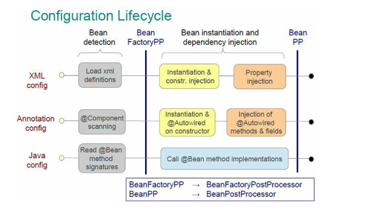

## Пример инициализации Spring контекста

### Работа с контекстом

Пакеты `org.springframework.app.beans` и `org.springframework.context` являются основными для Spring Framework IoC контейнера.

- Интерфейс `BeanFactory`
    - lazy bean initialization
    - основной интерфейс для взаимодействия с бинами
    - заботится о жизненном цикле бина
    - нужно вручную зарегестрировать `BeanPostProcessor` и `BeanFactoryPostProcessor`
    - не поддерживает annotation-based injection
    - `getBean()` , `containsBean()` , `isSingleton()` , `isPrototype()`
- `ApplicationContext` наследует `BeanFactory`.
    - initialize all beans at startup 
    - Производит автоматическую регистрацию `BeanPostProcessor` и `BeanFactoryPostProcessor`
    - Интеграция с spring AOP фичами
    - Публикует связанные с контекстом events
    - Поддерживает специфические контексты приложений: e.g. `WebApplicationContext`
    - `getBeanDefinitionNames()`
    
Конфигурации
- Xml-based - `ClassPathXmlApplicationContext`
- Annotation-based - `AnnotationConfigApplicationContext(config.xml)` - в xml добавить `component-scan`
    - `@Configuration`
    - `@Component`
    - `@Controller`
    - `@Service`
    - `@Repository`
    - `@Authowired`
    - `@Qualifier`
- Java-config - `AnnotationConfigApplicationContext(basePackage)` - `@Configuration` и `@ComponentScan`

### Шаги старта annotation-based контекста:

1. AnnotationConfigApplicationContext.scan()  - сканирование пакета и загрузка bean definitions  
2. старт контекста applicationStartup.start  
3. AbstractApplicationContext.prepareRefresh()  (org.springframework.context.support)  
4. AbstractApplicationContext.obtainFreshBeanFactory()  (org.springframework.context.support)  
5. AbstractApplicationContext.prepareBeanFactory(ConfigurableListableBeanFactory)  (org.springframework.context.support)  
    - конфигурирование стандартного factory's контекста -  context's ClassLoader and post-processors, Register default environment beans.  
6. AbstractApplicationContext.postProcessBeanFactory(ConfigurableListableBeanFactory)  (org.springframework.context.support)  
    - изменение beanFactory после стандартной инициализации бинов.  
    - все bean definitions загружены, но не инстанцированны  
    - это позволяет зарегистрировать кастомные BeanPostProcessors  
7. AbstractApplicationContext.invokeBeanFactoryPostProcessors(ConfigurableListableBeanFactory)  (org.springframework.context.support)  
    - Instantiate and invoke all registered BeanFactoryPostProcessor beans  
    - вызывается до инстанцирования синглтонов  
8. AbstractApplicationContext.registerBeanPostProcessors(ConfigurableListableBeanFactory)  (org.springframework.context.support)  
    - Instantiate and register all BeanPostProcessor beans  
    - вызывается до инстанцирование любых бинов приложения  
9. beanPostProcess.end()  
10. AbstractApplicationContext.initMessageSource()  (org.springframework.context.support)  
11. AbstractApplicationContext.initApplicationEventMulticaster()  (org.springframework.context.support)  
12. AbstractApplicationContext.onRefresh()  (org.springframework.context.support)  
13. AbstractApplicationContext.registerListeners()  (org.springframework.context.support)  
14. AbstractApplicationContext.finishBeanFactoryInitialization(ConfigurableListableBeanFactory)  (org.springframework.context.support)  
    - инициализация синглтонов тут  
15. AbstractApplicationContext.finishRefresh()  (org.springframework.context.support)  
    - последний шаг - публикация соответствующего евента  